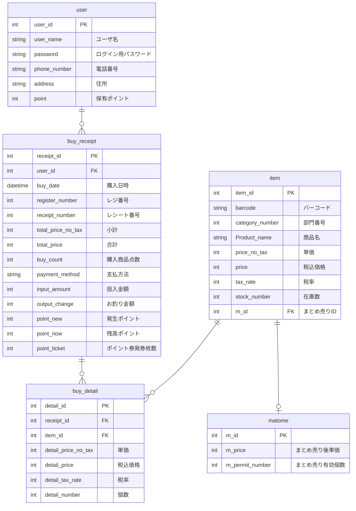

## ポイントカード照会

**ポイント残高**を照会できます。

## ER図

```mermaid
erDiagram
    user{
        int user_id PK
        string user_name "ユーザ名"
        string password "ログイン用パスワード"
        string phone_number "電話番号"
        string address "住所"
        int point "保有ポイント"
    }

    buy_receipt{
        int receipt_id PK
        int user_id FK
        datetime buy_date "購入日時"
        int register_number "レジ番号"
        int receipt_number "レシート番号"
        int total_price_no_tax "小計"
        int total_price "合計"
        int buy_count "購入商品点数"
        string payment_method "支払方法"
        int input_amount "投入金額"
        int output_change "お釣り金額"
        int point_new "発生ポイント"
        int point_now "残高ポイント"
        int point_ticket "ポイント券発券枚数"
    }

    buy_detail{
        int detail_id PK
        int receipt_id FK
        int item_id FK
        int detail_price_no_tax "単価"
        int detail_price "税込価格"
        int detail_tax_rate "税率"
        int detail_number "個数"
    }

    item{
        int item_id PK
        string barcode "バーコード"
        int category_number "部門番号"
        string Product_name "商品名"
        int price_no_tax "単価"
        int price "税込価格"
        int tax_rate "税率"
        int stock_number "在庫数"
        int m_id FK "まとめ売りID"
    }

    matome{
        int m_id PK
        int m_price "まとめ売り後単価"
        int m_permit_number "まとめ売り有効個数"
    }

user ||--o{ buy_receipt : ""
buy_receipt ||--o{ buy_detail : ""
item ||--o{ buy_detail : ""
item ||--o| matome : ""

```

**各テーブルの扱う情報について**

user : ユーザの個人情報等 
buy_receipt : 買い物の基本情報等 
buy_detail : 買い物で購入した商品情報等 
item : 商品情報等 
matmome : まとめ売り情報等 
