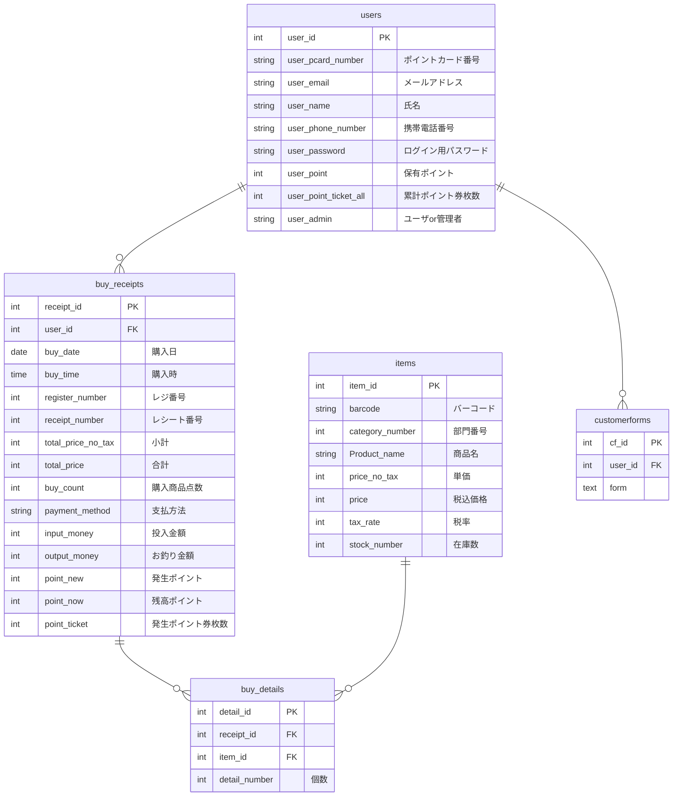

## ポイントカード照会システム

とあるスーパーのポイントカード残高ポイントを照会するサービス(以下、本システム)です。 
本システムでは、**ポイント残高照会**の他、ポイントカード会員様の買い物履歴、スーパーの商品検索、スーパーへのお問い合わせメッセージの送信を行うことができます。 
また、管理者ページでは、お問い合わせメッセージを一覧で確認することが出来ます。 
なお、本システムは、XAMPPの起動、phpMyAdminによるデータベースへの接続が必須となっております。  
一般会員様ページへのログイン方法： 
ID(メールアドレス):2@gmail.com 
パスワード:0000 
※新規会員登録は可能ですが、こちらの会員様には買い物履歴存在しますため、機能の確認にはこちらのご利用を推奨いたします。  
管理者ページへのログイン方法： 
ID(メールアドレス):1@gmail.com 
パスワード:0000 
※管理者権限の付与は、本システム上では行うことが出来かねますため、機能の確認にはこちらのご利用を推奨いたします。
## ER図

**各テーブルの扱う情報について**

user : ユーザの個人情報等 
buy_receipt : 買い物の基本情報等 
buy_detail : 買い物で購入した商品情報等 
item : 商品情報等 
matmome : まとめ売り情報等 

## API仕様書

### ① GET /search_result
・・・商品検索結果の概要を返す。
  
内容： 
{ 
　search_result: [ 
　　{ 
　　　p_name: ??? 
　　　price_no_tax: ???, 
　　　price: ???, 
　　　stock_number: ???, 
　　　bar_code: ??? 
　　} 
　] 
} 
 
説明： 
p_name: 商品名 
price_no_tax: 税抜価格(本体価格), 
price: 税込み価格, 
stock_number: 在庫数, 
bar_code: バーコード 
