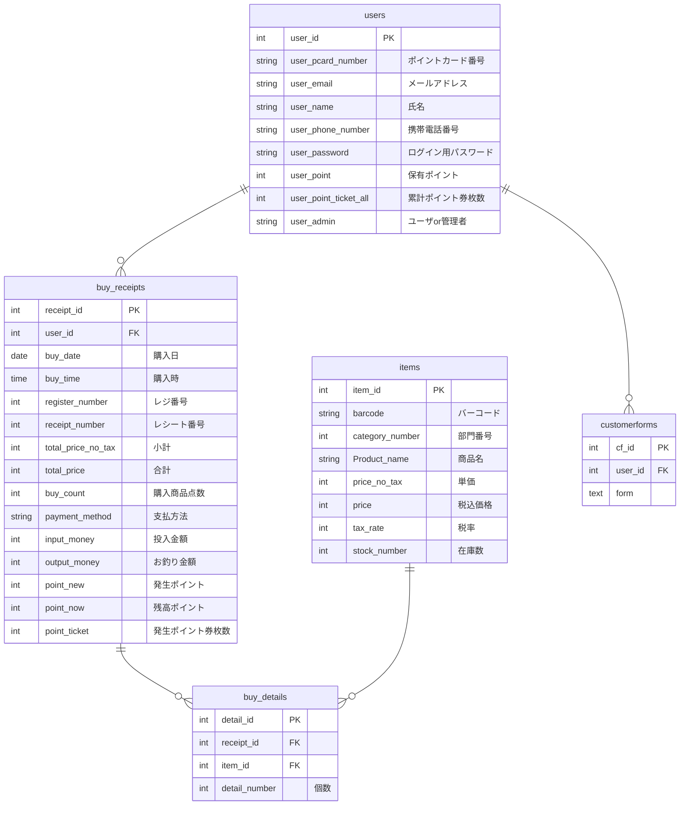

## ポイントカード照会システム

とあるスーパーのポイントカード残高ポイントを照会するサービスです。 
**ポイント残高照会**の他、ポイントカード会員様の買い物履歴、スーパーの商品検索、スーパーへのお問い合わせメッセージの送信を行うことができます。 
また、管理者ページでは、お問い合わせメッセージを一覧で確認することが出来ます。  
一般会員様ページへのログイン方法： 
ID(メールアドレス):2@gmail.com 
パスワード:0000 
※新規会員登録は可能ですが、こちらの会員様には買い物履歴存在しますため、機能の確認に推奨します。 

管理者ページへのログイン方法： 
ID(メールアドレス):1@gmail.com 
パスワード:0000 

## ER図

**各テーブルの扱う情報について**

user : ユーザの個人情報等 
buy_receipt : 買い物の基本情報等 
buy_detail : 買い物で購入した商品情報等 
item : 商品情報等 
matmome : まとめ売り情報等 

## API仕様書

### ① GET /search_result
・・・商品検索結果の概要を返す。
  
例 
{ 
　receipt: [ 
　　{ 
　　　receipt_id: 1, 
　　　buy_date: "2023/11/01", 
　　　buy_time: "12:34", 
　　　receipt_number: 1234, 
　　　total_price: 2023, 
　　　payment_method: "クレジットカード決済", 
　　　point_new: 8, 
　　　point_now: 8, 
　　　point_ticket: 0 
　　} 
　] 
} 
 
説明： 
receipt_id: レシートID 
buy_date: 購入日 
buy_time: 購入時間 
receipt_number: レシート番号 
total_price: 合計金額 
payment_method: 支払方法 
point_new: 発生ポイント 
point_now: 残留ポイント 
point_ticket: 発生ポイント券枚数 
